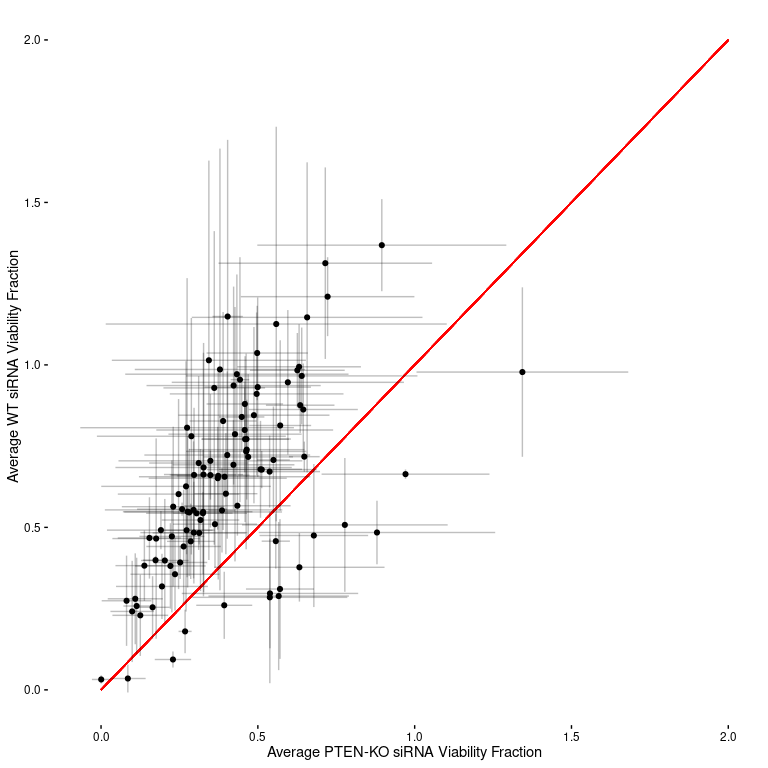

Screen Results - HCC1806
================
Matthew Berginski
11/19/2020

Results of the PTEN-KO vs WT siRNA screen. Each plate was normalized to
the median of the three replicates. Then the cell titer glo values were
scaled to the range between mean of the two siRNA controls on a
per-plate basis.

# Variation in Per Plate siRNA Controls

<!-- -->

# Per siRNA Target WT vs PTEN-KO Cell Growth/Viability

<!-- -->

# Per siRNA Target WT vs PTEN-KO Cell Growth/Viability with 95% Conf Interval

I’ve added 95% confidence intervals (represented by lines in the x/y
directions) for each siRNA treatment.

This figure is way to noisy to make out anything about the individual
siRNA treatments, but I think it’s helpful to get a grasp on how much
variability there is in the plate replicates.

<!-- -->

# Histogram of the Difference in Viability/Growth for each siRNA treatment

Same data as above except represented as the difference between KO/WT.
The average difference is -0.137.

<!-- -->

# Searching for Significant Differences in Cell Viability

I took the cell viability results and ran a t-test on all the WT vs KO
values. I adjusted the resulting p-values for multiple testing and
filtered to the 0.05 level. There were 104 total hits. The following
table lists the hits, ordered by the genes with the strongest
differential affect on the KO cells.

Alright, so there are no hits in the HCC1806 data at the 0.05 level. You
have to back out to the 0.15 level to get any hits:

| hgnc\_symbol | WT\_mean\_frac | KO\_mean\_frac | KO\_change\_diff | p.value\_adj |
| :----------- | -------------: | -------------: | ---------------: | -----------: |
| KMT2A        |         1.1500 |       0.404000 |        \-0.74520 |       0.2725 |
| VPS37A       |         1.0100 |       0.344000 |        \-0.67040 |       0.2725 |
| PABPN1       |         0.9860 |       0.379000 |        \-0.60690 |       0.3052 |
| TDGF1        |         1.3100 |       0.715000 |        \-0.59790 |       0.2105 |
| DHRS7        |         0.9290 |       0.361000 |        \-0.56820 |       0.2725 |
| SIPA1L1      |         1.1300 |       0.559000 |        \-0.56720 |       0.3035 |
| BPIFC        |         1.0400 |       0.498000 |        \-0.53870 |       0.1193 |
| SDCBP        |         0.9710 |       0.433000 |        \-0.53830 |       0.2323 |
| KIAA0586     |         0.8070 |       0.274000 |        \-0.53230 |       0.2685 |
| ARNT         |         0.9360 |       0.423000 |        \-0.51380 |       0.2323 |
| CTTN         |         0.9550 |       0.443000 |        \-0.51160 |       0.2725 |
| TLR6         |         0.7800 |       0.288000 |        \-0.49240 |       0.2323 |
| RGS19        |         1.1500 |       0.657000 |        \-0.48920 |       0.2725 |
| SORBS3       |         1.2100 |       0.722000 |        \-0.48750 |       0.2323 |
| GALE         |         1.3700 |       0.895000 |        \-0.47320 |       0.2725 |
| ABLIM2       |         0.8270 |       0.389000 |        \-0.43820 |       0.2698 |
| TGFBR3       |         0.9320 |       0.499000 |        \-0.43210 |       0.2323 |
| MICU3        |         0.8800 |       0.458000 |        \-0.42130 |       0.1193 |
| GLIS3        |         0.9110 |       0.496000 |        \-0.41460 |       0.2323 |
| CACNG8       |         0.8400 |       0.449000 |        \-0.39130 |       0.1193 |
| LYAR         |         0.6980 |       0.311000 |        \-0.38680 |       0.2323 |
| SOX14        |         0.6610 |       0.297000 |        \-0.36480 |       0.2323 |
| CENPF        |         0.9940 |       0.632000 |        \-0.36270 |       0.2021 |
| SGIP1        |         0.7870 |       0.427000 |        \-0.35970 |       0.3013 |
| BMPER        |         0.8450 |       0.488000 |        \-0.35770 |       0.2562 |
| SFMBT1       |         0.9830 |       0.626000 |        \-0.35740 |       0.1193 |
| EMC2         |         0.6840 |       0.327000 |        \-0.35730 |       0.3013 |
| NIPA1        |         0.7050 |       0.349000 |        \-0.35620 |       0.2630 |
| KRTAP27-1    |         0.6260 |       0.271000 |        \-0.35520 |       0.3013 |
| RABAC1       |         0.6020 |       0.247000 |        \-0.35510 |       0.2630 |
| MFSD1        |         0.9460 |       0.596000 |        \-0.35080 |       0.3013 |
| ZNF606       |         0.8000 |       0.458000 |        \-0.34160 |       0.2685 |
| IMPACT       |         0.6630 |       0.327000 |        \-0.33600 |       0.3052 |
| CDH1         |         0.5640 |       0.230000 |        \-0.33360 |       0.2323 |
| SOGA3        |         0.9660 |       0.640000 |        \-0.32620 |       0.3052 |
| MRPL14       |         0.7230 |       0.402000 |        \-0.32020 |       0.2685 |
| OR4Q3        |         0.4670 |       0.154000 |        \-0.31310 |       0.1193 |
| KRTAP19-4    |         0.7710 |       0.459000 |        \-0.31220 |       0.2685 |
| C19orf18     |         0.6610 |       0.349000 |        \-0.31200 |       0.1193 |
| PROZ         |         0.7720 |       0.464000 |        \-0.30820 |       0.1193 |
| COPS3        |         0.4920 |       0.191000 |        \-0.30060 |       0.2323 |
| SLC35G3      |         0.5560 |       0.258000 |        \-0.29770 |       0.2323 |
| TMEM33       |         0.4660 |       0.176000 |        \-0.28990 |       0.3013 |
| VAMP1        |         0.6580 |       0.374000 |        \-0.28480 |       0.3052 |
| NAT14        |         0.6510 |       0.372000 |        \-0.27920 |       0.2584 |
| ZNF446       |         0.7390 |       0.465000 |        \-0.27470 |       0.2323 |
| RABL6        |         0.5480 |       0.276000 |        \-0.27200 |       0.2685 |
| ZNF585B      |         0.7340 |       0.463000 |        \-0.27120 |       0.3013 |
| TAS2R50      |         0.6930 |       0.422000 |        \-0.27040 |       0.2323 |
| CLPTM1       |         0.5460 |       0.281000 |        \-0.26480 |       0.2725 |
| POLR3H       |         0.6560 |       0.394000 |        \-0.26190 |       0.3052 |
| FKBPL        |         0.5540 |       0.295000 |        \-0.25880 |       0.3013 |
| NSUN7        |         0.7170 |       0.469000 |        \-0.24780 |       0.3002 |
| CLASRP       |         0.4720 |       0.226000 |        \-0.24650 |       0.2826 |
| PRR4         |         0.5810 |       0.335000 |        \-0.24560 |       0.2323 |
| PHC3         |         0.3820 |       0.138000 |        \-0.24410 |       0.1193 |
| INTS8        |         0.8140 |       0.571000 |        \-0.24230 |       0.3035 |
| ZFP69        |         0.8760 |       0.635000 |        \-0.24100 |       0.1193 |
| CCDC24       |         0.5430 |       0.305000 |        \-0.23880 |       0.2715 |
| MRPL42       |         0.3990 |       0.174000 |        \-0.22530 |       0.1193 |
| NTAQ1        |         0.5470 |       0.325000 |        \-0.22190 |       0.3035 |
| PFDN6        |         0.5440 |       0.325000 |        \-0.21890 |       0.1193 |
| CDC26        |         0.4910 |       0.273000 |        \-0.21830 |       0.1193 |
| STEAP3       |         0.8630 |       0.645000 |        \-0.21790 |       0.2614 |
| KIAA1191     |         0.6040 |       0.398000 |        \-0.20560 |       0.2715 |
| PSIP1        |         0.5230 |       0.317000 |        \-0.20540 |       0.3013 |
| IRF2BP2      |         0.3980 |       0.203000 |        \-0.19470 |       0.3013 |
| EVPL         |         0.2740 |       0.081400 |        \-0.19280 |       0.2323 |
| NAA30        |         0.4840 |       0.296000 |        \-0.18790 |       0.2725 |
| POMGNT2      |         0.4410 |       0.263000 |        \-0.17790 |       0.2725 |
| RUVBL2       |         0.2800 |       0.109000 |        \-0.17120 |       0.2630 |
| CHTOP        |         0.4570 |       0.286000 |        \-0.17110 |       0.2323 |
| NSUN6        |         0.6790 |       0.508000 |        \-0.17020 |       0.2698 |
| SLC25A2      |         0.4830 |       0.313000 |        \-0.17000 |       0.3002 |
| NUTF2        |         0.5520 |       0.386000 |        \-0.16660 |       0.2715 |
| TUBB4B       |         0.6780 |       0.512000 |        \-0.16550 |       0.3035 |
| SFSWAP       |         0.3810 |       0.221000 |        \-0.16010 |       0.2675 |
| UBIAD1       |         0.7070 |       0.550000 |        \-0.15770 |       0.3035 |
| NAA38        |         0.5100 |       0.363000 |        \-0.14650 |       0.2826 |
| SYNE3        |         0.2580 |       0.114000 |        \-0.14450 |       0.3035 |
| SYNJ2        |         0.2410 |       0.099200 |        \-0.14210 |       0.3035 |
| RNF181       |         0.3920 |       0.252000 |        \-0.13980 |       0.2323 |
| ATP1B1       |         0.6720 |       0.538000 |        \-0.13410 |       0.3052 |
| TMEM127      |         0.3180 |       0.194000 |        \-0.12410 |       0.3052 |
| GEMIN4       |         0.3560 |       0.236000 |        \-0.12000 |       0.3052 |
| PRPF38A      |         0.2290 |       0.125000 |        \-0.10420 |       0.3052 |
| COLEC10      |         0.2540 |       0.164000 |        \-0.08964 |       0.3013 |
| EOGT         |         0.7180 |       0.648000 |        \-0.06951 |       0.2323 |
| LYPLA2       |         0.0320 |       0.000534 |        \-0.03148 |       0.2826 |
| RPA1         |         0.0349 |       0.085500 |          0.05051 |       0.3035 |
| PMVK         |         0.1800 |       0.268000 |          0.08810 |       0.2698 |
| CNFN         |         0.4580 |       0.557000 |          0.09958 |       0.2685 |
| CDK11A       |         0.2600 |       0.393000 |          0.13250 |       0.2587 |
| RRM1         |         0.0934 |       0.229000 |          0.13580 |       0.1969 |
| KCTD9        |         0.4750 |       0.679000 |          0.20360 |       0.3013 |
| TMED5        |         0.2970 |       0.539000 |          0.24190 |       0.3035 |
| ZNF549       |         0.2850 |       0.538000 |          0.25340 |       0.3013 |
| YJEFN3       |         0.3770 |       0.632000 |          0.25530 |       0.3035 |
| NFIC         |         0.3100 |       0.571000 |          0.26020 |       0.2685 |
| TREX1        |         0.5080 |       0.777000 |          0.26970 |       0.3052 |
| PIEZO1       |         0.2890 |       0.566000 |          0.27780 |       0.2685 |
| BCAS2        |         0.6640 |       0.971000 |          0.30700 |       0.3013 |
| GPR132       |         0.9780 |       1.340000 |          0.36550 |       0.2715 |
| FKBP4        |         0.4840 |       0.880000 |          0.39560 |       0.3013 |

# A Few Visualizations of the Hit Table

Same style figure as before, but filtered to only the hits in the above
table.

<!-- -->

Same figure as above, but with labels for each gene and colored the
points/labels by the strength of the KO vs WT effect.

<!-- -->

A small multiples visualization of each gene hit, in order by the
differential effect on the KO cells.

    ## Warning: Removed 2 rows containing missing values (geom_point).

<!-- -->

# Comparison with MDAMB231

I’ve pulled in the MDAMB231 viability summaries in to compare to the
HCC1806. The correlation between the two cell lines is essentially zero,
with a possible trend towards a negative correlation.

<!-- -->
